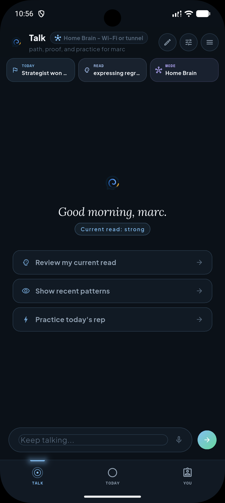
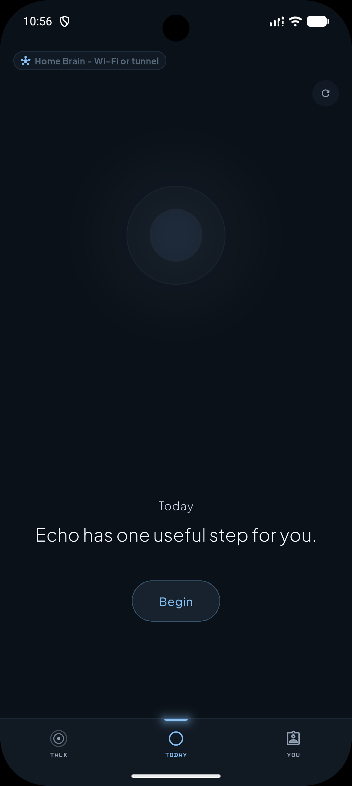
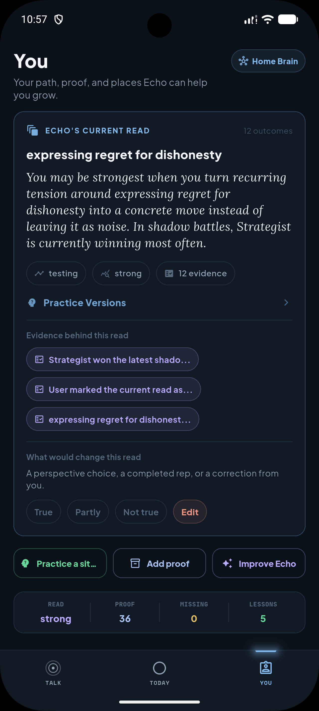
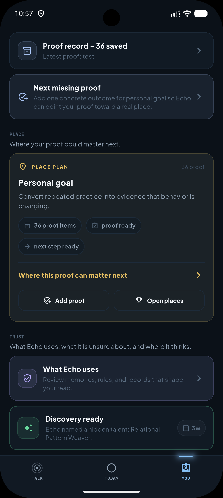
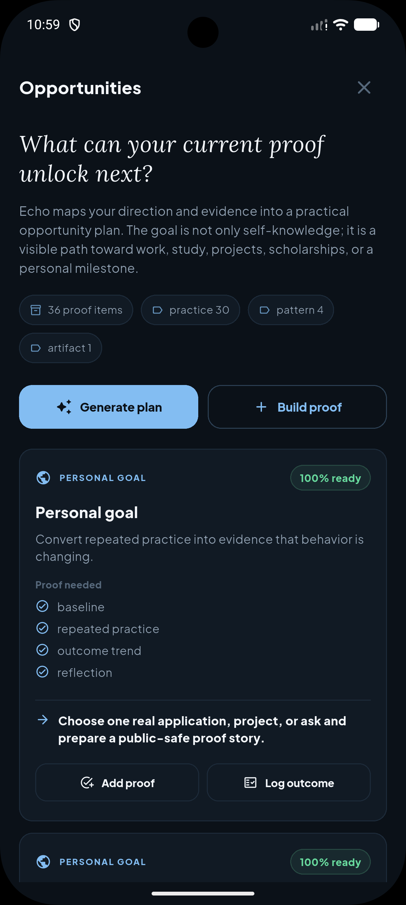
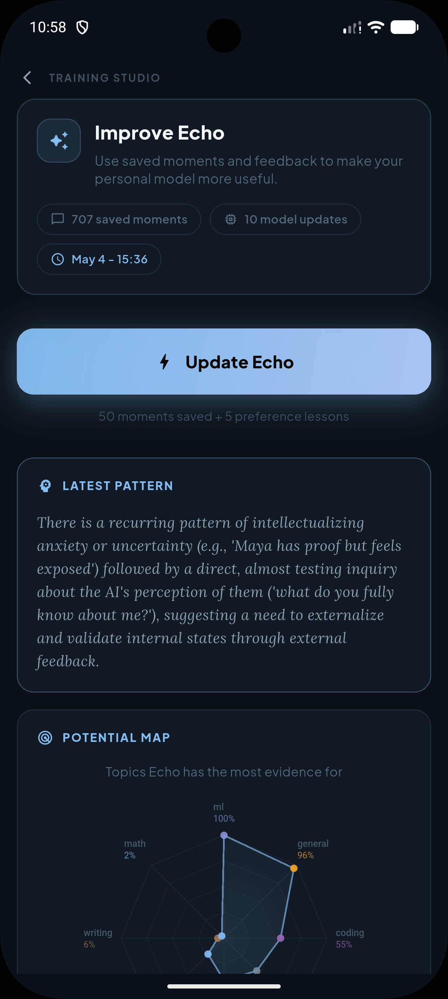
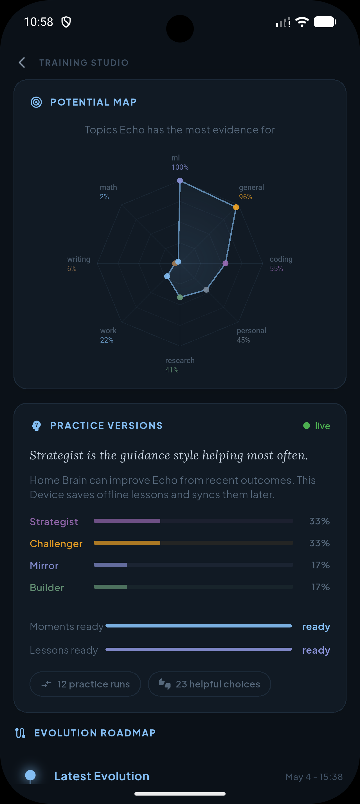
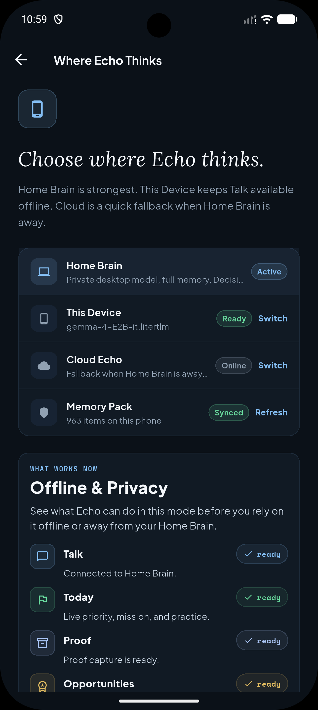

<p align="center">
  
</p>

<h1 align="center">Echo — Mobile App</h1>

<p align="center">
  <strong>Discover signal. Train it daily. Turn effort into proof.</strong>
</p>

<p align="center">
  A local-first growth companion for people whose progress is real but not yet visible.<br/>
  Private memory. Offline continuity. Personal Gemma 4 adapter trained from your own behavior.
</p>

<p align="center">
  <a href="https://github.com/klei30/echo_mobile">Mobile App</a>
  |
  <a href="https://github.com/klei30/echo">Backend</a>
  |
  <a href="https://www.kaggle.com/competitions/gemma-4-good-hackathon">Gemma 4 Good</a>
</p>

---

<table>
  <tr>
    <td align="center"><br/><sub><b>Talk</b><br/>Context-aware chat with Current Read injected before every response</sub></td>
    <td align="center"><br/><sub><b>Today</b><br/>One useful next step — practice rep, check-in, or mission</sub></td>
    <td align="center"><br/><sub><b>Current Read</b><br/>Living thesis built from evidence — rate it, correct it, watch it evolve</sub></td>
    <td align="center"><br/><sub><b>Discovery</b><br/>Echo surfaces a hidden pattern — earned, not given on day one</sub></td>
  </tr>
  <tr>
    <td align="center"><br/><sub><b>Opportunities</b><br/>Proof-scored paths toward real goals — shows exactly what's missing</sub></td>
    <td align="center"><br/><sub><b>Improve Echo</b><br/>707 saved moments → 10 model updates → personal Gemma 4 adapter</sub></td>
    <td align="center"><br/><sub><b>Shadow Clone Training</b><br/>4 parallel adapter variants compete — Strategist, Challenger, Mirror, Builder</sub></td>
    <td align="center"><br/><sub><b>Runtime</b><br/>Home Brain, This Device (offline LiteRT-LM), Cloud Echo — switch anytime</sub></td>
  </tr>
</table>

---

## Why Echo Exists

We believe every person has talent.

The problem is that most people discover it by accident, if they discover it at all. A teacher notices something. A friend gives the right push. A project happens to reveal a skill. A random opportunity creates confidence. For many people, that moment never comes.

Not because they lack ability.

Because their signal is never observed long enough to become direction.

Echo is built around that belief: talent is often hidden in ordinary behavior. The things someone keeps returning to, avoids, finishes, abandons, improves at, gets energy from, or struggles to explain are all signal.

Echo captures that signal privately — on the phone, offline, and on a desktop the user owns — and turns it into a loop:

```
Signal -> Current Read -> Daily Practice -> Outcome -> Proof -> Opportunity
```

Then it closes the model loop:

```
Feedback -> Preference Pairs -> Training Data -> Custom LoRA -> Eval -> Better Echo
```

Most AI products answer questions. Echo helps a person discover what they could become, practice it, prove it, and use that proof to reach the next opportunity.

---

## What Echo Is

Echo is not a generic chatbot, self-improvement app, or public profile.

Echo is a private growth companion for people whose progress is real but not yet visible.

It helps a user:

- discover direction from real behavior, not a personality quiz;
- get one concrete daily practice rep based on their current read;
- think through decisions with full memory and personal context;
- track outcomes, not just conversations;
- convert artifacts and effort into proof;
- score proof against real opportunities;
- keep working offline on their phone with LiteRT-LM Gemma;
- improve the underlying Gemma model through their own custom LoRA adapter.

The mobile app is the daily surface. Home Brain is the private desktop runtime. This Device is the offline phone runtime. Cloud Echo is a continuity lane when the desktop is unavailable.

---

## What It Actually Feels Like

**Day one.** You open the app, pick Home Brain or Cloud Echo. Echo asks one question: *What are you trying to get better at right now?* Not your job title. Not your goals. What you're trying to get better at. You answer. That's your first training signal.

**A week in.** You've been using Talk daily. You mentioned feeling stuck before presenting twice. You skipped a practice rep once. Echo's Current Read now shows a thesis with a confidence chip: *Strong analytical voice. Avoids public commitment before ideas are "perfect."* Today's priority card proposes one thing: send one rough idea to someone before it's ready. Not polish. Send it rough.

**The Decision Room.** You get an offer. You're not sure. You open Decision Room → Council. Four reasoning styles each read your current thesis, your proof items, and your recent decisions — then give you a synthesized view. The contrarian says: *You've deferred twice before. This is structurally the same choice.* You run Twin next — two frames side by side. You choose. That choice is a preference pair the model learns from.

**Three months in.** You want to apply for something. You → Opportunities. Status: *not ready — missing one public-safe artifact demonstrating independent delivery.* Echo built that from reading your proof items against the opportunity criteria. It knows the exact gap. You close it. Status flips to *ready.*

**After 300 interactions.** Today shows training readiness. You open Training Studio and tap trigger. On Home Brain, five parallel adapter variants train overnight: SFT on your best moments, Group DPO on your Decision Room choices, self-critique on the answers you corrected. Eval picks the winner. It hot-swaps into vLLM. Tomorrow Echo responds slightly more like someone who has only ever talked to you.

**Offline, no connection.** You sync your memory pack before going off-grid. For a week you talk, log practice, check in. Everything queues locally. When you reconnect, it all uploads. Three weeks of signal feeds the next training cycle. The model didn't pause. It queued.

---

## Who Echo Is For

**The person without a coach.** First-generation student, career changer, someone with ambition but no mentor or insider network. Echo gives them what a coach does: observation, honest pattern feedback, a structured next step, and a permanent record of what they can actually do — built entirely from their own behavior, not a personality quiz.

**The person in a low-connectivity environment.** Working without reliable internet, in a region where cloud AI is expensive or blocked, or simply wanting full data privacy. Echo runs on hardware they own — desktop and phone. No subscription. No data leaving the device. Offline mode queues everything and syncs back when reconnected. The model trains on their desktop overnight from their own signal.

**The person who wants to know what they're actually good at.** Not what they hope. Not what their resume says. Echo watches for months — decisions made, things avoided, practice reps logged — and builds a thesis from evidence. The Discovery moment is earned, not shown on day one. When it appears, it is a pattern Echo actually observed.

---

## The Core Product Loop

### 1. Current Read

Echo builds a living read of the user from conversations, memories, check-ins, outcomes, proof, decisions, and repeated patterns.

It is not a personality quiz. It is a working hypothesis:

- what the user is drawn toward;
- what they avoid;
- where they show consistency;
- what evidence supports the read;
- what the next useful test should be.

The Current Read has a confidence label, evidence chips, and a correction row. The user can mark it True, Partly true, or Not true. Corrections become training signal.

### 2. Daily Practice

Echo turns the Current Read into one small rep per day.

Examples:

- write one paragraph;
- solve one problem;
- send one message;
- record one explanation;
- publish one rough artifact;
- ask for one piece of feedback;
- practice one interview answer.

The rep creates an outcome. The outcome updates the read.

### 3. Decision Room

People do not only need knowledge. They need help choosing.

Decision Room uses the user's full context — thesis, proof, memories, recent decisions — to reason through questions like:

- Should I apply?
- Which path fits me?
- What am I avoiding?
- What proof is missing?
- What happens if I keep doing this for six months?

Modes: Council (four reasoning styles), Twin (two competing frames, user picks), Tournament (candidates compete), Parallel Self (two diverging paths). Every choice becomes preference signal for training.

### 4. Proof Passport

Echo turns private effort into reusable evidence:

- projects, artifacts, feedback quotes;
- practice wins, decisions, outcomes;
- skills practiced;
- public-safe proof cards.

The point is not to expose private memory. It is to help the user package what they have actually done — and score it against opportunities.

### 5. Opportunities

Echo compares the Proof Passport against real goals:

- job application, scholarship, portfolio, accelerator;
- open-source contribution, community project, personal goal.

It identifies missing proof and turns the gap into the next practice rep. The loop closes.

---

## Shadow Clone Training

Echo's product story is talent discovery and proof.

The training architecture is inspired by Naruto's shadow clones: one person cannot collect enough reps alone, so parallel versions train, fail, and return the useful lesson to the original.

Echo applies that idea to model adaptation. When there is enough signal, Home Brain trains multiple adapter variants in parallel with Unsloth/LlamaFactory and lets eval choose the strongest one.

Training signal comes from:

- chat turns and thumbs up/down;
- corrections and explicit feedback;
- Decision Room choices (Twin, Tournament);
- practice outcomes and daily check-ins;
- proof creation and opportunity progress.

Adapter variants:

| Variant | What it learns |
| --- | --- |
| **SFT** | The user's best interactions and preferred answer style |
| **SeqKD** | Teacher reasoning distilled into the Gemma lane |
| **Self-critique** | Corrections from weak or inaccurate answers |
| **Group DPO** | Preferences from Decision Room choices and comparisons |
| **On-policy** | Improvements against live Echo outputs |

Pipeline:

```
User signal
  -> training pairs and preference pairs
  -> Unsloth/LlamaFactory training
  -> SFT / SeqKD / Self-critique / Group DPO / On-policy
  -> held-out eval
  -> winning custom LoRA
  -> hot-swap into vLLM
```

The custom LoRA belongs to the user. It runs on their own Home Brain desktop. The mobile app shows training state, readiness, and eval results — but training itself runs on Home Brain. Offline conversations queue locally and feed the next training cycle when reconnected.

---

## Three Runtimes

| Runtime | Role |
| --- | --- |
| **Home Brain** | Private desktop runtime paired to the phone. Echo API, SQLite, mem0/Qdrant memory, Gemma 4 E2B via vLLM, personal LoRA adapter, Training Studio, Decision Room, MCP tools, LiveKit voice, Cloudflare tunnel, QR phone pairing. |
| **This Device** | Offline phone runtime. LiteRT-LM Gemma 4 E2B on Android, synced memory pack injected into prompts, queued chats and outcomes, cached Today and Passport state. Everything uploads when reconnected. |
| **Cloud Echo** | Online continuity when Home Brain is unavailable. Memory and product APIs stay live. |

Echo is local-first because the people who need opportunity infrastructure most cannot assume stable internet, paid cloud AI, elite networks, or polished credentials.

---

## Mobile App — Three Tabs

### Talk

Natural conversation with Echo. Before every response, Echo injects your current read, today's priority, and relevant memories. After you respond, the turn becomes a potential training signal.

Runtime pill in the header shows your active runtime — Home Brain, Cloud Echo, or This Device. Tap it to see your full context snapshot: thesis, priority, practice rep, memory state.

### Today

Your daily action surface. Echo shows the single most useful next thing:

- today's priority and daily mission;
- practice rep — one focused activity tied to your current read;
- daily check-in — structured outcome capture;
- Decision Room entry when a choice needs parallel thinking;
- proactive interventions — trusted nudges Echo is allowed to send, each with a named reason.

### You (Passport)

Your evolving profile. Echo shows what it currently believes about you, backed by evidence:

- **Current Read** — thesis with confidence label and supporting evidence chips
- **Discovery** — when Echo has enough signal, it reveals a named pattern: a strength, a direction, a readiness signal. Earned, not shown on day one.
- **Talent** — what Echo actually sees in how you think and act
- **Progress Evidence** — milestones, practice reps, decisions, model updates
- **Training State** — how close you are to the next personal model update
- **Opportunities** — proof-scored paths Echo has identified

---

## Desktop Navigation

On wide screens Echo shows a full sidebar:

| Section | Purpose |
| --- | --- |
| Talk | Main conversation workspace |
| Today | Daily practice and priority dashboard |
| You | Personal profile — thesis, talent, progress, proof, opportunities |
| Proof | Proof Builder and Opportunities — first-class on desktop |
| Improve Echo | Training Studio, memories, connected apps, signal capture |
| Home Brain | Service health, Gemma 4, tunnel, QR phone pairing |
| Advanced | Raw MCP server setup and Home Brain connection |

---

## Offline Mode

Echo's offline mode is continuity, not a fallback product.

- Import or download a `.litertlm` Gemma 4 E2B model on Android
- Sync an Echo memory pack from Home Brain or Cloud Echo
- Compressed memory injects into LiteRT-LM prompts
- Talk, Today, and Proof stay live without network
- Conversations and outcomes queue locally
- Offline signal uploads to Home Brain training when reconnected

Offline sync: **You → Runtime → This Device → Sync Echo memory to this phone**

---

## MCP — Connected Tools

Echo uses MCP as the foundation for connected-action workflows. Built-in tools expose the full product loop to any MCP-compatible agent:

| Tool | Purpose |
| --- | --- |
| `echo_training_center` | Training readiness, DPO pairs, runs, eval, adapter status, trigger |
| `echo_daily_brief` | Priority, mission, practice, check-in, next intervention |
| `echo_current_read` | Thesis, evidence, discovery status, loop snapshot, user signal |
| `echo_decision_room` | Decide, Council, Twin, Tournament |
| `echo_memory_editor` | View, add, delete memories and rules |
| `echo_signal_capture` | Save pair, memory, rule, life event, outcome, practice result |
| `echo_threads_inbox` | List and resolve recurring threads |
| `echo_proof` | Proof items, from-outcome, missing proof tracking |
| `echo_opportunities` | Scored opportunity paths from current proof |

External MCP servers can be added from **Connected Apps**. Supports stdio, SSE, and in-memory servers.

---

## Backend

The Echo backend is a FastAPI service in the sibling [echo](https://github.com/klei30/echo) repository.

```
Echo Mobile App
  Talk / Today / You / Proof / Training / Offline
        |
        | local Wi-Fi, secure tunnel, cloud
        ↓
Echo Backend :8002
  Memory (mem0 + Qdrant), daily loop, Decision Room,
  proof, opportunities, training, voice, MCP tools
        |
        ↓
Home Brain Gemma 4 E2B vLLM :8003
  base Gemma 4 E2B or personal LoRA adapter
```

---

## Privacy and Boundaries

Echo's strongest mode keeps all personal data on the user's own machine:

- conversations, outcomes, proof, and product state in `echo.db`;
- vector memory in `qdrant_data/`;
- training datasets in `training_data/`;
- personal LoRA adapters in `adapters/`.

Current boundaries:

- Home Brain is required for full private Gemma inference, voice, MCP tools, and LoRA training;
- This Device offline uses synced memory plus a base on-device model;
- on-device LoRA loading is not yet implemented — the phone uses the base model with injected memory;
- public tunnels require production secrets and endpoint hardening before exposing to the internet.

---

## Hackathon — Gemma 4 Good

Echo was built for the [Kaggle Gemma 4 Good Hackathon](https://www.kaggle.com/competitions/gemma-4-good-hackathon).

| Track | Why Echo |
| --- | --- |
| **Digital Equity** | Offline LiteRT-LM for zero-connectivity use. Home Brain gives private Gemma 4 inference to people who cannot afford cloud AI. No subscription, no data leaving the device. |
| **Future of Education** | Not a tutor. A system that discovers how *this person* learns, what they avoid, what they need to practice — then literally trains a model that adapts to them. |
| **LiteRT** | Full offline continuity: LiteRT-LM Gemma 4 E2B on Android + synced memory pack. Conversations queue and upload back to training when reconnected. |
| **Unsloth** | Five parallel LoRA variants trained from real user interaction, eval-gated, hot-swapped into vLLM. Shadow Clone principle in production. |
| **Cactus** | Transparent routing across three model layers: Home Brain Gemma 4 + personal LoRA, Cloud Echo, This Device LiteRT-LM. Runtime pill visible in every chat. |

---

## Download

| Platform | File | Notes |
| --- | --- | --- |
| Android | [echo-android.apk](https://github.com/klei30/echo_mobile/releases/latest/download/echo-android.apk) | Enable "Install unknown apps" in Android settings |
| Windows | [echo-windows.zip](https://github.com/klei30/echo_mobile/releases/latest/download/echo-windows.zip) | Extract and run `chatmcp.exe` |

---

## Getting Started

### Prerequisites

- Flutter 3.x
- Android toolchain (for mobile) or Windows (for desktop)
- Echo backend running at `http://localhost:8002` (or a tunnel URL)

### Install and Run

```powershell
flutter pub get
flutter run
```

### Build Release APK

```powershell
flutter build apk --release
```

### Connect to Echo Backend

On first launch, Echo shows the onboarding flow. Choose:

- **Home Brain** — pair with your desktop running the Echo backend
- **Cloud Echo** — use an external API key
- **This Device** — offline LiteRT-LM mode (import a `.litertlm` model)

To pair with Home Brain:
1. Start the Echo backend: `.\start_echo_services.bat`
2. Open **Home Brain** in the desktop app → generate a QR code
3. Scan from **You → Runtime → Pair Computer** on mobile

---

## Project Layout

```
lib/
  echo/                 Echo API client, services, theme, design system
  page/
    echo_mobile.dart    Root shell, onboarding gate, runtime pill, navigation
    onboarding/         5-step onboarding flow
    echo_tabs/          All Echo product screens
    layout/             Chat page, sidebar, input area
    setting/            App and provider settings
  provider/             State: chat, models, settings
  mcp/                  MCP client — stdio, SSE, in-memory, streamable
  llm/                  Direct provider clients (OpenAI, Gemini, Ollama, etc.)
  dao/                  SQLite chat history
assets/
  echo_logo.png
docs/
  screenshots/          README gallery images
pubspec.yaml
```

---

## License

See `LICENSE`.
